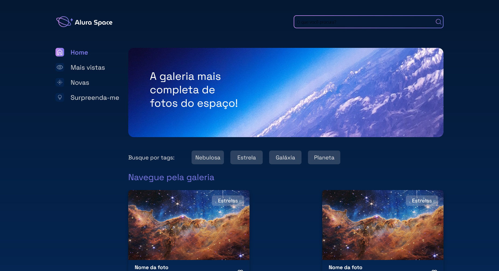

# Alura Space

The first app create using django (library for python).

## How to run

```py
python -m virtualenv venv
source venv/Scripts/activate
python manage.py runserver
```

## Run port

```
Port running at the: http://localhost:8000/
```
